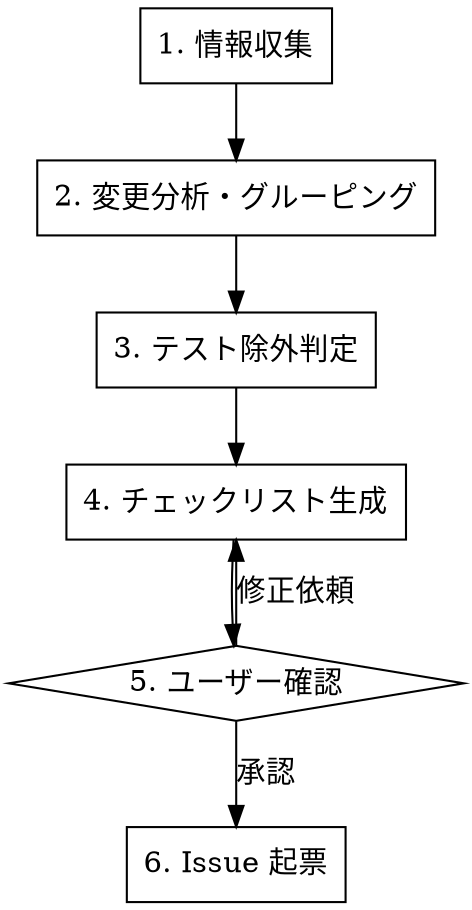

# 手動テストチェックリスト Issue 作成

比較元バージョンタグから最新 main までのコード変更を分析し、手動での動作確認が必要な項目を GitHub Issue として起票する。

**原則**: 手動でしか確認できない変更（視覚的変更、ブラウザ動作、レスポンシブ等）を漏れなくチェックリスト化する。

## Process



### Step 0: 比較元タグの決定

`$ARGUMENTS` が指定されている場合はそのタグを使用する。省略された場合は直前のタグを自動検出する:

```bash
BASE_TAG=$(git describe --tags --abbrev=0)
echo "比較元タグ: $BASE_TAG"
```

以降のステップでは、決定したタグを `<BASE_TAG>` として参照する。

### Step 1: 情報収集

以下を並列で収集する:

```bash
# 変更ファイル一覧（プロダクションコードのみ）
git diff --name-only <BASE_TAG>...main -- 'src/'

# 変更統計
git diff --stat <BASE_TAG>...main -- 'src/' | tail -1

# コミット一覧
git log <BASE_TAG>...main --oneline

# マージ済み PR 一覧（Issue番号の紐づけ用）
git log <BASE_TAG>...main --merges --oneline

# 関連 Issue/PR
gh pr list --state merged --limit 50 --json number,title,headRefName,baseRefName --search "base:main"
```

### Step 2: 変更分析・グルーピング

変更ファイルを以下の単位でグルーピングする:

1. **components/**: コンポーネント単位（React / Astro）
2. **layouts/**: レイアウトコンポーネント
3. **pages/**: ページ
4. **styles/**: SCSS / スタイル
5. **store/**: 状態管理（nanostores）
6. **scripts/**: ビルドスクリプト・ユーティリティ
7. **integrations/**: Astroインテグレーション
8. **public/**: 静的アセット

各グループについて:

- 変更内容の概要を把握する（git diff で実際のコード変更を読む）
- 関連する PR/Issue 番号を紐づける
- 重要度を判定する（Critical / High / Medium / Low）

**重要度判定基準:**

| 重要度       | 基準                                                                   |
| ------------ | ---------------------------------------------------------------------- |
| **Critical** | レイアウト全体の大規模変更、ビルド設定変更、ページ構造変更             |
| **High**     | 主要コンポーネントの動作変更、ユーザーに見えるUI変更、ページ追加・削除 |
| **Medium**   | 軽微なスタイル変更、エッジケース修正、アクセシビリティ改善             |
| **Low**      | スタイリング微調整、パフォーマンス改善、内部リファクタ                 |

### Step 3: テスト除外判定

#### 手動テスト必須の変更

以下に該当する変更は**常に手動テスト必須**:

| カテゴリ                   | 例                                       | 理由                       |
| -------------------------- | ---------------------------------------- | -------------------------- |
| UI/レイアウト・視覚的変更  | CSS/SCSS変更、コンポーネント表示         | 視覚的確認が必要           |
| レスポンシブデザイン       | ブレークポイント変更、メディアクエリ     | 実際のリサイズ操作が必要   |
| ページ遷移・ナビゲーション | リンク変更、ルーティング                 | ブラウザでの遷移確認が必要 |
| インタラクション           | メニュー開閉、スクロール、アニメーション | 操作体験の確認が必要       |
| SEO・メタデータ            | OGP、サイトマップ、robots.txt            | 出力HTMLの確認が必要       |
| 画像・アセット             | 画像最適化、ファビコン                   | 視覚的確認が必要           |
| ビルド出力                 | Astro設定変更、インテグレーション        | ビルド結果の確認が必要     |

#### 除外対象（チェックリストに含めない）

- ドキュメント・コメントのみの変更
- 型定義のみの変更（ランタイムに影響しない `type`, `interface` のみ）
- CI/CD 設定の変更
- `console.log` の追加/削除
- テストファイルのみの変更

### Step 4: チェックリスト生成

**サブエージェントを活用して並列分析する。** 機能グループごとにサブエージェント（`subagent_type: "Explore"`）を起動し、各グループの変更内容を詳細に分析してチェック項目を洗い出す。

各サブエージェントには以下を指示する:

- 担当グループの変更差分（`git diff <BASE_TAG>...main -- <path>`）を分析
- Step 3 のテスト除外判定基準を適用
- 具体的なチェック項目を「操作手順 → 期待結果」の形式で出力

オーケストレータ（メインClaude）は:

- 各サブエージェントの結果を統合する
- 重複項目を排除する
- セクション分け・重要度順に整理する

**チェック項目の書き方:**

- 具体的な操作と期待結果を記述する（「X が動く」ではなく「X を実行 → Y が表示される」）
- 関連 Issue 番号 `(#xxx)` を付与する
- 些細な変更でも手動確認が必要なら含める（漏れなく）

### Step 5: ユーザー確認

生成したチェックリストをユーザーに提示し、以下を確認する:

- 項目の過不足
- 重要度の妥当性
- セクション分けの適切さ

承認を得てから Issue 起票に進む。

### Step 6: Issue 起票

Issue 本文を構築し `gh issue create` で起票する。テンプレート内の `<TAG>`, `<COMMITS>`, `<FILES>` 等のプレースホルダは、Step 1〜4 で収集した実際の値に置き換えること。

**ラベル**: プロジェクトで利用可能なラベルは `gh label list` で確認する。

**Issue フォーマット:**

```markdown
## リリース前動作確認

**対象変更範囲**: `<TAG>` → `main` (<COMMITS> commits, <FILES> production files changed)

### 自動検証結果

- スクリプトリント: **passed / failed**
- スタイルリント: **passed / failed**
- ビルド: **passed / failed**

---

## セクション 1: [機能名] (Critical)

> #Issue番号 — 変更の概要説明

### 1.1 [サブカテゴリ]

- [ ] 操作の説明 → 期待結果 (#関連Issue)
- [ ] 操作の説明 → 期待結果 (#関連Issue)

---

## セクション N: [機能名] (Low)

...

---

> **凡例**
>
> - ⬜ `[ ]` = 手動での動作確認が必要
> - ✅ `[x]` = 確認完了

🤖 Generated with [Claude Code](https://claude.com/claude-code)
```

**Issue 起票時の注意:**

- 起票前に既存 Issues との重複確認を行う
- セクションは重要度順（Critical → High → Medium → Low）
- 自動テスト実行結果（リント、ビルド）を冒頭に記載する

## 自動テスト実行

Issue 起票前に以下を実行し、結果を Issue 冒頭に記載する:

```bash
# スクリプトリント
pnpm lint:scripts

# スタイルリント
pnpm lint:styles

# ビルド
pnpm build
```

## エッジケース

| ケース                 | 対応                                                                     |
| ---------------------- | ------------------------------------------------------------------------ |
| 変更ファイルが5件未満  | セクション分けせず、単一リストで簡潔に起票する                           |
| 変更ファイルが200件超  | 機能グループごとに `git diff` を分割して読み、コンテキスト超過を避ける   |
| 機能が完全に削除された | 「削除された機能の要素が表示されないこと」を確認項目にする               |
| 全変更が除外された     | Issue 起票は不要。ユーザーに「全変更が自動テストでカバー済み」と報告する |
